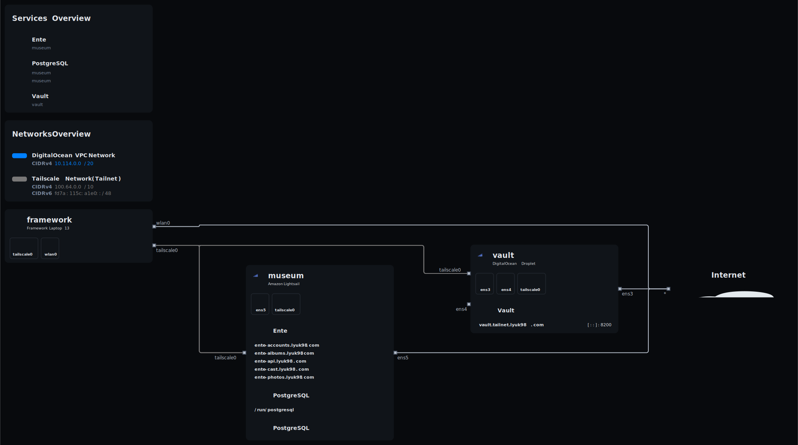

[](https://builtwithnix.org/)

# NixOS configurations



This repository contains a flake managing configurations of my personal devices as well as my infrastructure.

## NixOS hosts

This configuration currently applies to the following list of devices:

| Name | Type | Hardware | Usage |
| --- | --- | --- | --- |
| [framework](./hosts/framework/default.nix) | 💻 Laptop | Framework Laptop 13 | Personal laptop |
| [museum](./hosts/museum/default.nix) | ☁️ VPS | Amazon Lightsail | Museum instance |
| [vault](./hosts/vault/default.nix) | ☁️ VPS | DigitalOcean Droplet | Vault instance |
| [xps13](./hosts/xps13/default.nix) | 💻 Laptop | Dell XPS 13 9350 | Personal laptop/server |

## Features

The following is non-exhaustive lists of features present in this configuration.

### NixOS

NixOS modules are used to configure each device's system. Each feature is listed together with a link to the source.

#### Global

The following features are applied to every device managed by this configuration:

- Disabled access to root ([`disable-root.nix`](./hosts/common/core/disable-root.nix))
- [Edit](https://github.com/microsoft/edit) as the default text editor ([`msedit.nix`](./hosts/common/core/msedit.nix))
- Persisting only what is necessary with [Preservation](https://github.com/nix-community/preservation) ([`preservation.nix`](./hosts/common/core/preservation.nix))
- Declarative secret provisioning with [sops-nix](https://github.com/Mic92/sops-nix) ([`sops.nix`](./hosts/common/core/sops.nix))
- [sudo-rs](https://github.com/trifectatechfoundation/sudo-rs) for assuming root privileges ([`sudo.nix`](./hosts/common/core/sudo.nix))
- Network name resolution with systemd-resolved ([`systemd-resolved.nix`](./hosts/common/core/systemd-resolved.nix))
- WireGuard-based private networking via [Tailscale](https://tailscale.com/) ([`tailscale.nix`](./hosts/common/core/tailscale.nix))
- Memory compression ([`zram.nix`](./hosts/common/core/zram.nix))

#### Optional

The following features can be used by some devices:

- Support for AppImage execution ([`appimage.nix`](./hosts/common/optional/appimage.nix))
- [COSMIC](https://system76.com/cosmic) desktop environment ([`cosmic.nix`](./hosts/common/optional/cosmic.nix))
- [GNOME](https://www.gnome.org/) desktop environment ([`gnome.nix`](./hosts/common/optional/gnome.nix))
- [KDE Connect](https://kdeconnect.kde.org/) for cross-device communication ([`kdeconnect.nix`](./hosts/common/optional/kdeconnect.nix))
- UEFI Secure Boot management with [Lanzaboote](https://github.com/nix-community/lanzaboote) ([`lanzaboote.nix`](./hosts/common/optional/lanzaboote.nix))
- Virtualisation support with [libvirt](https://libvirt.org/) ([`libvirt.nix`](./hosts/common/optional/libvirt.nix))
- [PipeWire](https://www.pipewire.org/) multimedia framework with support for ALSA, JACK, and PulseAudio applications ([`pipewire.nix`](./hosts/common/optional/pipewire.nix))
- Graphical boot experience with Plymouth ([`plymouth.nix`](./hosts/common/optional/plymouth.nix))
- Randomised MAC address for hosts using NetworkManager ([`random-mac-address.nix`](./hosts/common/optional/random-mac-address.nix))
- Steam application ([`steam.nix`](./hosts/common/optional/steam.nix))
- Declarative NetworkManager connection profiles, such as Wi-Fi networks ([`system-connections.nix`](./hosts/common/optional/system-connections.nix))
- Alternative implementation of GNU coreutils with [uutils coreutils](https://github.com/uutils/coreutils) ([`uutils.nix`](./hosts/common/optional/uutils.nix))
- Network usage statistics with [vnStat](https://humdi.net/vnstat/) ([`vnstat.nix`](./hosts/common/optional/vnstat.nix))

### Home Manager

[Home Manager](https://github.com/nix-community/home-manager/) is used for declarative user configuration. Because there is currently only one user with one device using the service (which is me with the Framework Laptop 13), the distinction between global and optional features does not make much sense at this time. It is nevertheless still kept in case of having multiple devices and/or users.

#### Global

- Bash with VTE integration ([`bash.nix`](./home/lyuk98/common/core/bash.nix))
- [EditorConfig](https://editorconfig.org/) with a few global configurations ([`editorconfig.nix`](./home/lyuk98/common/core/editorconfig.nix))
- Git with [libsecret](https://gitlab.gnome.org/GNOME/libsecret) support and declarative global settings ([`git.nix`](./home/lyuk98/common/core/git.nix))
- [GNU Privacy Guard](https://gnupg.org/) and gpg-agent ([`gnupg.nix`](./home/lyuk98/common/core/gnupg.nix))
- [nix-index](https://github.com/nix-community/nix-index) for locating files in Nixpkgs and providing `command-not-found` functionality ([`nix-index.nix`](./home/lyuk98/common/core/nix-index.nix))
- [Nix User Repository](https://github.com/nix-community/NUR) ([`nur.nix`](./home/lyuk98/common/core/nur.nix))
- [Pay Respects](https://github.com/iffse/pay-respects) for ~~pressing F~~ correcting previous commands ([`pay-respects.nix`](./home/lyuk98/common/core/pay-respects.nix))

#### Optional

- Running Android applications with [Android Translation Layer](https://gitlab.com/android_translation_layer/android_translation_layer/) ([`android-translation-layer.nix`](./home/lyuk98/common/optional/android-translation-layer.nix))
- [LV2 plugins](https://lv2plug.in/) for audio production ([`audio-plugins.nix`](./home/lyuk98/common/optional/audio-plugins.nix))
- Automatic loading and unloading of environment variables and, for Nix, development environment with [direnv](https://direnv.net/) ([`direnv.nix`](./home/lyuk98/common/optional/direnv.nix))
- Both free and non-free variants of FFmpeg ([`ffmpeg.nix`](./home/lyuk98/common/optional/ffmpeg.nix), [`ffmpeg-nonfree.nix`](./home/lyuk98/common/optional/ffmpeg-nonfree.nix))
- User-wide font configuration ([`fontconfig.nix`](./home/lyuk98/common/optional/fontconfig.nix))
- [fzf](https://github.com/junegunn/fzf), a command-line fuzzy finder ([`fzf.nix`](./home/lyuk98/common/optional/fzf.nix))
- User-specific GNOME extensions ([`gnome-extensions.nix`](./home/lyuk98/common/optional/gnome-extensions.nix))
- Command-line clipboard management with [wl-clipboard-rs](https://github.com/YaLTeR/wl-clipboard-rs) ([`wl-clipboard.nix`](./home/lyuk98/common/optional/wl-clipboard.nix))

On top of the above, the following GUI applications are present:

- Digital audio workstation ([`ardour.nix`](./home/lyuk98/common/applications/audio/ardour.nix), [`zrythm.nix`](./home/lyuk98/common/applications/audio/zrythm.nix))
- [Visual Studio Code](https://code.visualstudio.com/) with declarative settings ([`vscode.nix`](./home/lyuk98/common/applications/development/vscode.nix))
- [Zen Browser](https://zen-browser.app/) with declarative settings ([`zen-browser.nix`](./home/lyuk98/common/applications/network/zen-browser.nix))
- Video editors ([`davinci-resolve.nix`](./home/lyuk98/common/applications/video/davinci-resolve.nix), [`kdenlive.nix`](./home/lyuk98/common/applications/video/kdenlive.nix))

## Building

With `nix`, run:

```sh
nix-shell
```

Alternatively, if you have experimental features `flakes` and `nix-command` enabled, run:

```sh
nix develop
```

Build system configurations using `nixos-rebuild`:

```sh
nixos-rebuild build --flake .
```

Home Manager configurations are built together with the NixOS system. However, if it is desirable to separately do so, `home-manager` can be used:

```sh
home-manager build --flake .
```
